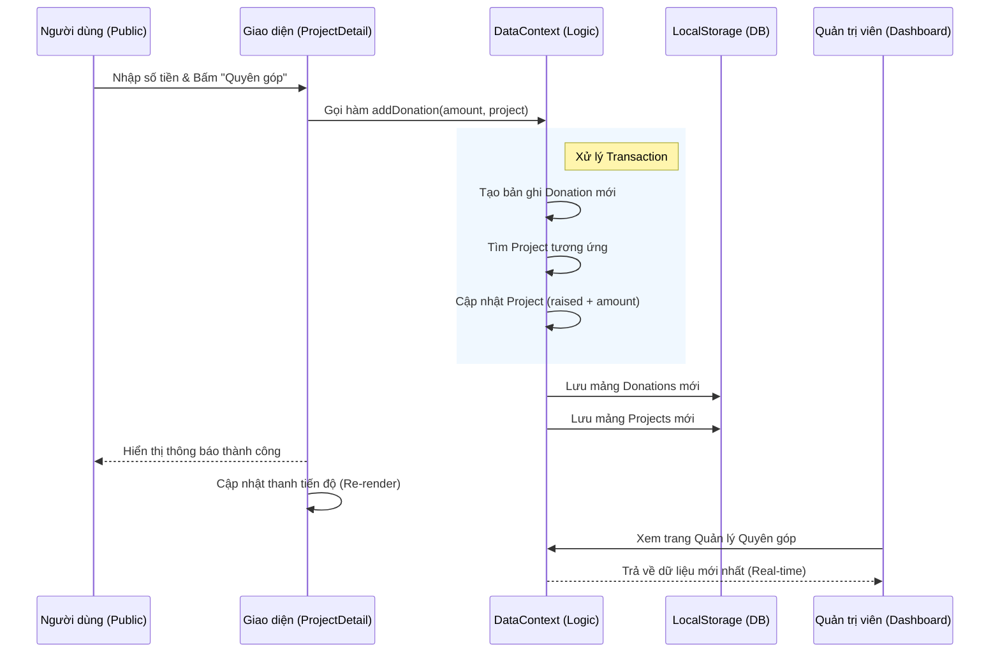
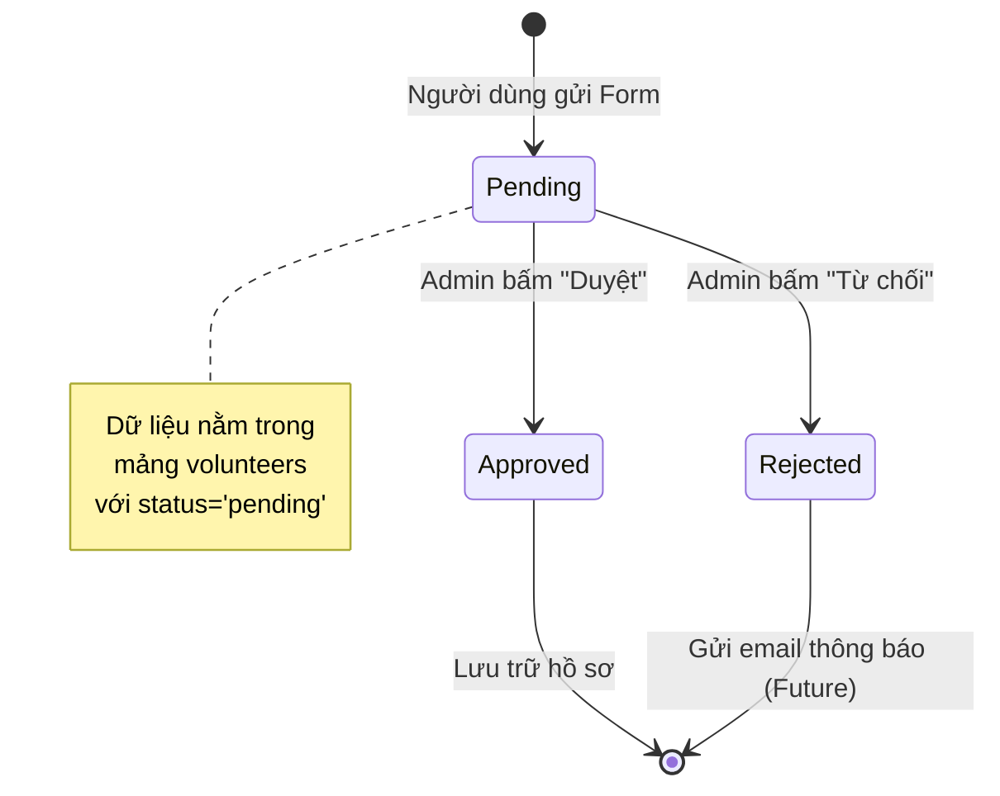
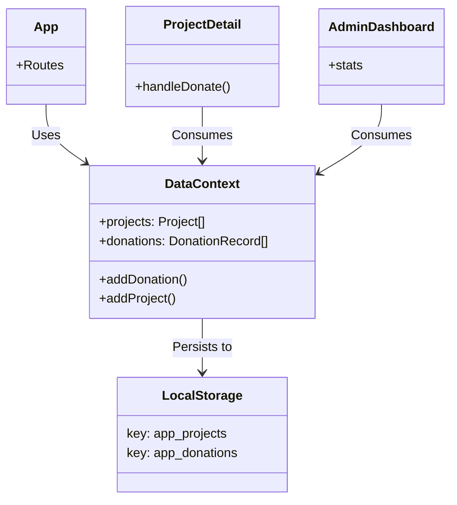

# Sơ đồ Kiến trúc Hệ thống

Tài liệu này mô tả luồng hoạt động và cấu trúc của hệ thống thông qua các biểu đồ Mermaid.

## 1. Sơ đồ Luồng Dữ liệu (Data Flow Diagram) - Quy trình Quyên góp
Mô tả cách dữ liệu di chuyển từ Người dùng Public đến Hệ thống lưu trữ và hiển thị cho Admin.



## 2. Sơ đồ Cấu trúc Ứng dụng (Component Structure)

```mermaid
graph TD
    App[App.tsx] --> Providers
    
    subgraph Providers [Context Providers]
        Auth[AuthProvider]
        Config[SiteConfigContext]
        Data[DataProvider]
    end
    
    Providers --> Router[React Router]
    
    Router --> Public[Public Layout]
    Router --> Private[Admin Layout (Protected)]
    
    subgraph PublicPages [Public Pages]
        Home
        ProjectDetail
        NewsList
        DonatePage[TransactionList]
        VolunteerForm
    end
    
    subgraph AdminPages [Admin Pages]
        Dashboard
        ProjectMgr[Project Manager]
        DonationMgr[Donation Manager]
        Settings
    end
    
    Public --> PublicPages
    Private --> AdminPages
    
    PublicPages -.->|Read/Write| Data
    AdminPages -.->|Read/Write| Data
    AdminPages -.->|Update Config| Config
```

## 3. Sơ đồ Trạng thái Tình nguyện viên (Volunteer State Machine)



## 4. Kiến trúc Thư mục & Mối quan hệ


